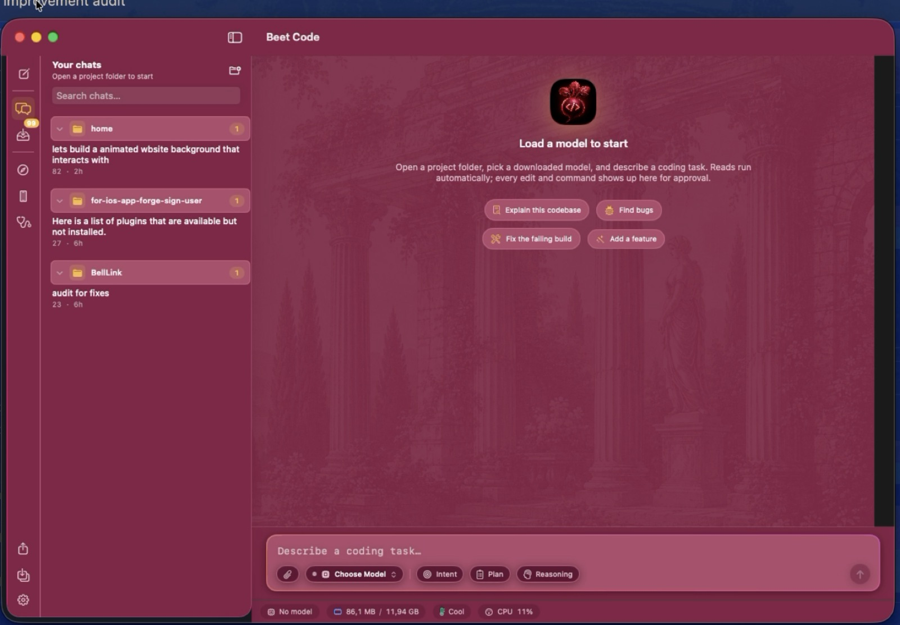
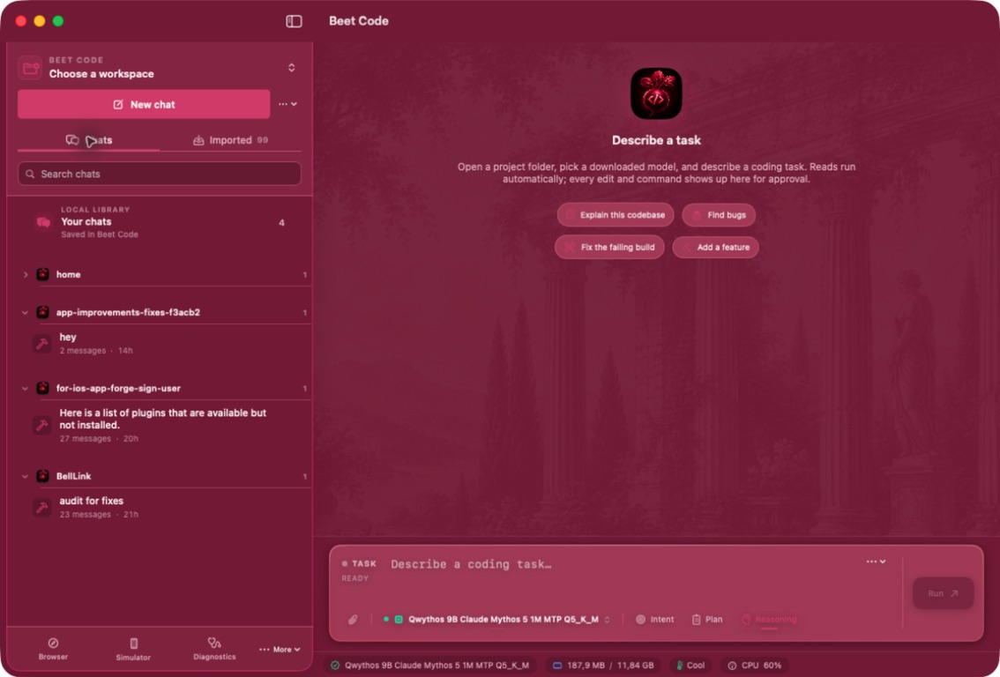
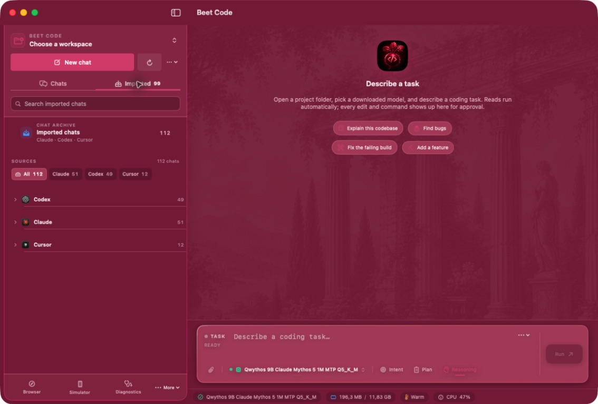
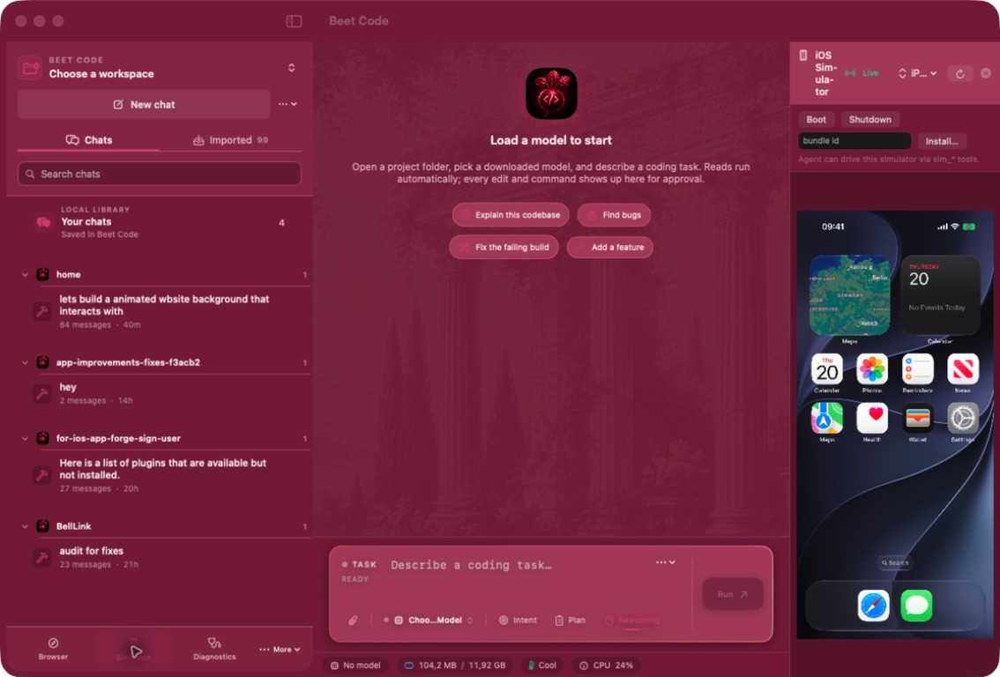
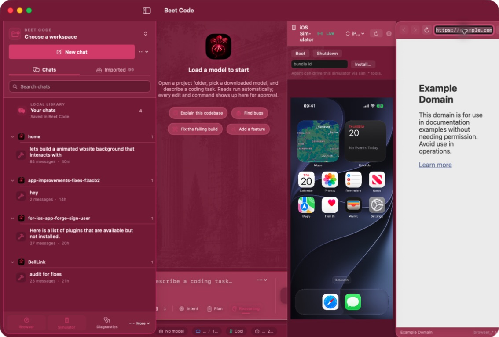

# Beet Code

A lightweight, native, **Apple Silicon-only macOS coding agent**. Beet Code runs MLX models in-process through Metal, downloads them directly from Hugging Face with pause/resume, and gives a local coding agent safe, reviewable tools.

[](https://github.com/Mesutcydev/beet-code/releases/latest/download/BeetCode-0.8.6.zip)
[](LICENSE)

<p align="center">
  
</p>

<p align="center">
  <a href="https://mesutcydev.github.io/beet-code/">Explore the promo page</a> ·
  <a href="https://github.com/Mesutcydev/beet-code/releases/latest">Download the latest release</a>
</p>

## Product previews

Beet Code keeps your project, model, chats, browser, and iOS Simulator in one simple Mac app.

| Homepage | Imported chats |
| --- | --- |
|  |  |

| iOS Simulator | In-app browser |
| --- | --- |
|  |  |

| Remote sessions |
| --- |
|  |

The [GitHub Pages site](https://mesutcydev.github.io/beet-code/) has the full preview gallery, light/dark mode, and app details.

**Install:** download the [ZIP](https://github.com/Mesutcydev/beet-code/releases/latest/download/BeetCode-0.8.6.zip), extract it, and move **Beet Code.app** to Applications (or Desktop). Apple Silicon + macOS 15+.

> Gatekeeper will warn — this build is Apple Development–signed, **not notarized** (Developer ID certs are revoked). Right-click → Open, or `xattr -dr com.apple.quarantine "/path/to/Beet Code.app"`.

> Phase 1 deliberately focuses on one polished path: MLX + MLX-quantized safetensors + core coding tools. GGUF/llama.cpp has since shipped (v0.2+, see the GGUF entries in the model catalog).


## v0.2 — safety, durability, diagnostics

Implemented and verified by the test suite (`xcodebuild … test`, 120+ tests,
no model weights or Metal needed):

- **Workspace confinement**: canonical realpath containment (symlink-safe,
  `/private/var`-consistent), per-operation intent, resolved-path reuse,
  bounded reads, excluded-descendant skipping.
- **Shell policy**: exact safe-command auto-approval (operators, substitution,
  redirection, backgrounding, and outside paths always ask); sanitized
  environment without Git override variables; process-group kill on
  timeout/cancel; typed command results.
- **Checkpoints**: sanitized git environment, foreign-tree rejection, tree
  retention under local refs (GC-safe), per-workspace serialization, index
  preservation on restore, symlink-safe cleanup, newline-safe paths.
- **AgentLoop**: run-state guard, one-shot stream completion, cancellation
  mapping, request-scoped approvals, one-tool-call protocol enforcement,
  assistant/tool-result history pairing, checkpoint-before-mutation with
  failure surfacing, deterministic fake-engine suite.
- **Durability**: encrypted (Keychain-key) sessions with redaction and
  bounded retention; AppPreferences restore with validation; download
  manifests with pause → quit → relaunch → resume; repair of stale model
  registry entries; memory-pressure model dumps clear the UI state.
- **Diagnostics**: `build_diagnostics` tool with Swift/Xcode output parsing,
  grouped-by-file UI, and optional post-edit verification that always runs
  through the approval path.
- **Repository context**: bounded workspace index respecting ignore rules and
  vendor exclusions, with per-file symbol summaries in the system prompt.

Manual acceptance checklist: [`docs/ACCEPTANCE-v0.2.md`](docs/ACCEPTANCE-v0.2.md).

## Workspace Intelligence

A deterministic, UI-independent intelligence layer (`Core/Intelligence/`) —
no LLM in retrieval, every fact provenance-labeled:

- **Workspace core**: move-safe workspace IDs, real git state, nested
  `.gitignore`, SHA-256 content hashing, snapshot deltas (rename-aware).
- **Symbol graph**: Swift parser → SQLite nodes/edges; edges form only on
  unambiguous name resolution. SourceKit-LSP can *upgrade* provenance, never
  invent symbols.
- **Incremental indexing**: delta-driven updates, FSEvents watching,
  invalidation journal; 1,000-file repo indexes in ~1.8 s, updates in ~0.1 s.
- **Context compiler**: budgeted `ContextPacket` (capsule ≤ 800 tokens,
  per-section caps) with per-item *why / confidence / freshness / cost*.
- **Knowledge**: evidence-gated durable knowledge with secret + injection
  scanning, conflict detection, and hash-based staleness.
- **Sessions**: branch-scoped working state and deterministic handoff
  packets.
- **Impact & claims**: graph-derived impact reports and structural claim
  verification (`callExists`, `testCoversSymbol`, …) with evidence.
- **Framework semantics**: SwiftUI/SwiftData entity detection (screens,
  providers, models, permissions, entitlements, endpoints…).
- **Agent-loop integration**: every task message is prefixed with a
  bounded `<workspace_intelligence>` block compiled for that task
  (configurable via `AgentLoop.Configuration.intelligenceContext`);
  workspace switches trigger a background incremental index.
- **Surfaces**: in-app Context Inspector (status bar pill), `lf intel …`
  CLI, a 12-tool MCP server (`lf intel serve-mcp`), and the
  `WorkspaceIntelligence` Swift facade.

Docs: [`ARCHITECTURE.md`](docs/ARCHITECTURE.md) ·
[`CONTEXT_COMPILER.md`](docs/CONTEXT_COMPILER.md) ·
[`KNOWLEDGE_MODEL.md`](docs/KNOWLEDGE_MODEL.md) ·
[`SDK.md`](docs/SDK.md) · [`BENCHMARKS.md`](docs/BENCHMARKS.md) ·
[`SECURITY.md`](docs/SECURITY.md)

## v0.3 — BYOK, simulator, memory, reasoning

- **BYOK remote engines**: OpenAI, DeepSeek, LongCat, Alibaba DashScope,
  Alibaba Token Plan, Gemini, OpenRouter, **Anthropic** (native Messages
  API), and a **Custom** OpenAI-compatible endpoint (Ollama, LM Studio,
  vLLM, Groq, proxies — key optional) — Keychain-backed API keys,
  provider/model settings with a live model-list refresh and a Test button,
  and a Model Manager section to switch between the local MLX engine and a
  remote provider. The agent loop is engine-agnostic.
- **Built-in iOS Simulator side panel**: docked next to the chat (activity
  rail toggle), with device list, boot/shutdown, app install/launch, and a live
  screenshot stream (public `simctl` APIs).
- **argent integration**: when `argent` is installed, the agent gets
  `sim_list_devices`, `sim_boot_device`, `sim_launch_app`, `sim_tap`,
  `sim_swipe`, `sim_type`, `sim_describe`, and `sim_screenshot` tools to
  drive the simulator — tap/swipe/type go through the normal approval card.
- **Vision**: `describe_image` tool using vision-capable BYOK providers
  (OpenAI / Gemini / OpenRouter). A local SmolVLM engine plugs into the same
  seam once mlx-swift-lm ships VLM support.
- **Memory**: Mem0/Letta-style per-workspace memory with modes (off /
  session summaries / facts / full); durable facts plus earlier-session
  summaries are injected into the system prompt with keyword relevance
  ranking; the agent can maintain facts with `memory_add`/`memory_delete`.
- **Compression options**: light / standard / aggressive context compaction
  (assistant/tool-result pairing always preserved).
- **Reasoning toggle**: show or hide `<think>` chain-of-thought blocks
  (local Qwen3 and remote reasoning models, whose `reasoning_content` is
  folded into think blocks).
- **Thermal fix**: `ProcessInfo.thermalState` alone stays `.nominal` on
  warm Apple Silicon Macs; a CPU-load proxy (public `host_processor_info`)
  now escalates the effective state under sustained load, so the status bar
  and throttling reflect real warmth.
- **UI**: animated Copilot-style composer with configurable flow presets,
  streaming cards with a typing indicator, richer approval cards, and
  diagnostics with breadcrumbs and grouped-by-file presentation.
## v0.4 — hardening and agent competitiveness

- **Restored-session seed**: continuing a restored session seeds the loop
  with the persisted record so history and checkpoints carry over.
- **Simulator off the main actor**: `SimctlRunner` runs simctl through the
  process-group shell runner (hard timeouts, cancellation); the panel state
  lives in `@MainActor SimulatorContext`.
- **Stronger confinement**: the workspace root is re-validated on every
  path resolution; symlink/prefix checks were hardened with more tests.
- **Remote switch unloads local**: activating a BYOK provider explicitly
  unloads the resident MLX model first.
- **Hard tool timeouts everywhere**: git, rg, argent, and simctl all run
  through `ShellRunner` (posix_spawn + process group + kill on timeout).
- **Build to install to launch to screenshot to inspect**: `sim_build_run`
  runs the full loop in one tool call (xcodebuild, simctl install/launch,
  screenshot, vision describe), so the agent can verify UI work end to end.
- **Verification before completion**: with verification enabled, a failing
  build-diagnostics pass refuses `attempt_completion` and feeds the errors
  back until the build is clean.
- **Failure classification**: tool failures carry typed tags
  (`[timeout]`, `[command exit N]`, `[workspace]`, etc.) so the model and UI
  can react without string-sniffing.
- **Agent phase state machine**: planning, awaiting plan approval, working,
  awaiting approval/question, verifying, finished - surfaced in the UI.
- **Task-ranked repo context**: the workspace index ranks files by task
  relevance so the prompt leads with what matters.

## v0.5 — local API server + concurrency hardening

- **OpenAI-compatible local API server**: `Core/Server/LocalAPIServer` is a
  zero-dependency HTTP/1.1 server over POSIX sockets, bound to 127.0.0.1
  only (nothing outside this Mac can reach it). Routes: `GET /v1/models`,
  `POST /v1/chat/completions` (streaming SSE + non-streaming), `GET
  /health`, CORS for browser clients. The endpoint is **stateless**: every
  request resets the engine session and replays the full conversation, so
  Codex `--oss`, Claude Code, Aider, or any OpenAI-format client can drive
  BeetCode's loaded model. Toggle it in Settings → General → Local API
  Server (port configurable, status dot, copy-curl-example), or run it
  headless with `lf serve [--port N] [--model <catalog-id>]`.
- **Keychain deadlock chain eliminated (F9/F9b/F9c)**: session
  encryption previously held the store mutex across `SecItemCopyMatching`
  — an invisible Keychain prompt (which ad-hoc re-signed builds trigger
  after every binary change) froze the app and the test host. All
  Keychain access now (1) runs outside locks, (2) fails fast with
  `kSecUseAuthenticationUISkip` and a visible one-click "Unlock" banner in
  the sidebar, and (3) uses a deterministic in-process key under XCTest so
  the suite never touches securityd.
- **Layering fix**: `ComposerFlow` and `SimctlRunner` moved from App to
  Core so the CLI target compiles (it previously didn't).
- **Settings**: Local API Server card; composer style + animated-border
  toggle moved out of the chat toolbar into Settings → General.

## v0.6 — provider hardening + agent-controlled browser

- **Provider audit fixes (13 findings)**: UTF-8-safe SSE parsing (multi-byte
  characters no longer corrupt across chunk boundaries), tool-role
  translation so agent turns work on OpenAI/Gemini/Anthropic, reasoning-model
  handling (`max_completion_tokens`, no forced temperature), Gemini
  `systemInstruction` + adjacent-role merging, inactivity watchdog + one
  bounded 429/503 retry honoring `Retry-After`, truthful token usage
  (`stream_options`/`usageMetadata`/Anthropic `usage`), live `/v1/models`
  refresh in Settings, API keys out of URLs (Gemini `x-goog-api-key`
  header), User-Agent everywhere.
- **In-app browser the agent controls**: docked WKWebView panel (activity
  rail toggle, URL bar, back/forward/reload). Agent tools: `browser_read`
  (text/links/info, auto-approved), `browser_screenshot`, and the
  approval-gated `browser_navigate` / `browser_click` (selector or visible
  text) / `browser_type` / `browser_eval`. All agent-supplied strings are
  escaped through one JS-literal boundary; screenshots land in
  `.beetcode/screenshots/`.

## v0.7 — Intent replaces the Lattice; composer redesign

- **The Intent Lattice is gone.** The 48-cell role × context grid (and its
  weights, muted states, and dead superposition toggle) is replaced by
  **Intent**: four role chips (Research / Build / Review / Verify) and four
  focus chips (@files / @git / @docs / @codebase) with real, bounded
  resolvers, plus role-curation presets. Selection serializes into a plain,
  auditable preface to the message — no invented fences, no weight metadata,
  empty sources honestly marked `(nothing found)`.
- **Redesigned composer**: one elevated card (editor + accessory row),
  attachment chips, Intent picker popover with active-count badge, Plan and
  Reasoning toggle chips, honest token estimate (`≈ chars/4` against the
  model's real context window; absolute-only when the window is unknown),
  and send↔stop morphing. Enter sends, Shift+Enter newline, ⌘↩ sends, Esc
  stops the agent (single Esc owner — the old conflict is gone).
- Per-workspace composer drafts (prompt + intent selection) persist across
  sessions; intent is one-shot and clears on send.

## v0.8 — activity rail, chat import, themes, GGUF context + MTP

- **Activity rail**: a dedicated left rail now owns all panel toggles
  (simulator, browser, diagnostics, …) plus the new-chat button in a fixed,
  predictable order; the old chat-toolbar buttons and segmented picker are
  gone. Sidebar lists imported chats under distinctive, collapsible
  per-project headers instead of one flat list.
- **Chat history import**: Claude, Codex, and Cursor session history imports
  through a live parser with visible per-file status; imported transcripts
  keep their original structure (roles, tool calls, timestamps) so they read
  like native BeetCode sessions. Streaming is bounded (16 MB per file /
  512 KB per message) so a huge history can't wedge the app.
- **Workspace history digest**: the agent's system prompt carries a bounded
  digest of what earlier sessions in this workspace were about — BeetCode's
  own and imported ones alike.
- **Plugins**: Settings gains a Plugins tab; external command plugins are
  discovered and runnable from the app.
- **Themes**: light / dark / **beet** — beet mode tints the whole UI (not
  just accents), with contrast tuned for readability. The coding font and
  dark-mode palette were polished; the assistant avatar is now the beet logo
  instead of the generic sparkle.
- **KV-aware GGUF context admission**: the fixed 32 K context clamp is gone.
  The engine sniffs transformer dims from the GGUF header, prices KV cache
  bytes per token, and buys as much context as the RAM budget left after the
  weights affords (256 K sanity ceiling, 4 K floor). Unsniffable headers keep
  a conservative 32 K fallback.
- **MTP speculative decoding**: GGUF builds with nextn predictor tensors
  (e.g. Qwythos-9B MTP) launch llama-server with `--spec-type draft-mtp`
  automatically, with a self-healing retry without the flag when the server
  binary is too old. See [`docs/MTP-FEASIBILITY.md`](docs/MTP-FEASIBILITY.md).

## v0.8.4 — provider interoperability

- **OpenCode compatibility**: imports opencode.json / opencode.jsonc,
  provider and model definitions, Markdown commands and agents, ordered
  permission rules, and local or remote MCP servers. Build and Plan agents
  are available natively in the composer.
- **Major provider coverage**: OpenAI Responses and chat completions,
  Anthropic Messages, Gemini, OpenRouter, DeepSeek, Alibaba DashScope,
  LongCat, OpenCode Zen/Go, Mistral, Groq, xAI, Together AI, Fireworks,
  Cerebras, Perplexity, Cohere, Hugging Face, NVIDIA NIM, and DeepInfra.
  Custom OpenAI-compatible endpoints continue to cover Ollama, LM Studio,
  vLLM, llama.cpp, and private gateways.
- **Provider-aware model picker**: API and local models have separate
  menus; each remote model keeps its provider, protocol, endpoint, headers,
  capabilities, and model id together so a model-list refresh cannot select
  the wrong gateway.
- **Credential safety**: imported {env:…} / {file:…} values stay in memory,
  saved credentials remain in the macOS Keychain, and no endpoint or session
  export includes an API key.
- **Responsive composer**: the provider, agent, Auto/Goal, Plan, and
  Reasoning controls remain usable in narrow and portrait-sized windows.

## v0.8.5 — task reliability and provider polish

- Per-model capability overrides now apply to the exact provider/model
  endpoint, including imported OpenCode and dynamic gateway profiles.
- The task sidebar persists pins, workspace paths, running phases, and
  review-needed status for failed checks or tool errors.
- Verification detects Xcode workspaces/projects, XcodeGen projects, and Swift
  packages, preferring tests when the project contains test sources.
- Subagents have explicit research, implement, verify, and review roles with
  role-appropriate tools and inherited approval policy.
- `.beetcode.json` and `.beetcode.jsonc` provide shareable, non-secret project
  policy for agent defaults, plan/goal behavior, verification, tool filters,
  permissions, context hints, and answer style; credentials remain in the
  Keychain.
- Provider credentials accept common copied header forms such as `Bearer …`
  and `api_key=…` without storing the wrapper.

Project policy reference: [`docs/PROJECT-POLICY.md`](docs/PROJECT-POLICY.md).

## v0.8.6 — portable tasks and durable work

- Encrypted, versioned `.beetask` bundles export a bounded, redacted task
  transcript and require a passphrase on both export and import. Import always
  asks for a destination workspace; source paths and stale checkpoints are not
  trusted.
- Remote prompts can enter a durable queue while another task is running or a
  model is unavailable. Queue state survives relaunch, interrupted work is
  re-queued safely, and the native sidebar exposes the next task and removal
  controls.
- Concise, normal, and detailed response styles are enforced in the agent
  prompt, with workspace policy taking precedence over the global setting.
- Send, stop, and plan shortcuts are editable using readable forms such as
  `cmd+return` and `cmd+shift+p`.

## Requirements

- Apple Silicon Mac (arm64)
- macOS 15+
- **Xcode 26.6 or Xcode 27.0** / Swift 6 (the same `project.yml` builds on both)
- XcodeGen (`brew install xcodegen`)
- 8 GB Macs: Qwen3 1.7B is the recommended first model; 4B is marginal; 7B+ is refused by the admission gate on this tier.

## Build

```sh
xcodegen generate
xcodebuild -project BeetCode.xcodeproj \
  -scheme BeetCode \
  -destination 'platform=macOS' build

xcodebuild -project BeetCode.xcodeproj \
  -scheme BeetCode \
  -destination 'platform=macOS' test
```

The CLI harness builds alongside the app:

```sh
xcodebuild -project BeetCode.xcodeproj \
  -scheme BeetCodeCLI \
  -destination 'platform=macOS' build

# The binary is in Xcode DerivedData/Build/Products/Debug/BeetCodeCLI
lf status
lf download qwen3-1.7b-4bit
lf generate qwen3-1.7b-4bit 'Explain actors in one sentence.'

# Serve the model over an OpenAI-compatible local API (loopback only):
lf serve --port 1234 --model qwen3-1.7b-4bit
#   → POST http://127.0.0.1:1234/v1/chat/completions
```

## Architecture

```
SwiftUI
  └── AppState / AgentSessionController       UI boundary
        ├── ModelDownloadManager
        │     └── HFHubClient → SmartFileDownloader
        ├── MLXEngine → GenerationGate        in-process Metal inference
        │              └── MemoryAdvisor
        ├── ThermalMonitor / MemoryPressureCoordinator
        └── AgentLoop
              └── PermissionGate → ToolExecutor → core tools
```

The UI never directly manipulates MLX, files, or shell commands.

### Inference

- `mlx-swift-lm` 3.x (`MLXLLM`, `MLXLMCommon`) and `mlx-swift` are Swift Package Manager dependencies.
- `MLXEngine` loads a local model directory with `LLMModelFactory` and `HFTokenizerLoader`.
- `GenerationGate` serializes every Metal operation and queues cache clears until generation is idle. This avoids MLX's process-killing concurrent-command-buffer failure mode.
- Streaming uses `ChatSession` and Swift concurrency.

### Memory and thermal safety

`MemoryAdvisor` is the single model-load authority:

- Measures `phys_footprint`, not `resident_size`.
- Uses an 80% usable-RAM budget, 1.3× working-set overhead, and a configurable 500 MB headroom reserve.
- Verdicts: fit (<60%), marginal (60–95%), won't fit (>95%).
- Memory pressure warning clears MLX caches; critical pressure dumps the model only when this process is low on headroom, then blocks reloads for 20 seconds.
- Thermal hysteresis: 8 seconds heating / 15 seconds cooling; critical is immediate.
- Serious thermal state caps generation at 1,536 tokens; critical blocks new loads and caps at 512.

### Hugging Face downloads

- Token is stored in the macOS Keychain, never UserDefaults.
- Hub tree listing fetches file size, ETag, LFS SHA-256, and commit metadata.
- Each file uses explicit `Range: bytes=N-` requests and an `.incomplete.json` sidecar containing ETag, offset, total size, and expected digest.
- Pause survives app termination and resumes after a fresh ETag check; an HTTP 200 response to a resumed request correctly truncates and restarts.
- LFS files are SHA-256 verified before atomic rename; retries use exponential backoff with jitter; disk space is checked before transfer.
- The model manager downloads files sequentially so memory stays predictable and progress is easy to explain.

### Agent safety

The loop is:

```
generate → parse → PermissionGate → approval → Git checkpoint → execute → observe → repeat
```

Built-in tools:

- `read_file` (line-numbered, bounded, binary detection)
- `list_directory` (git/build directory filtering)
- `search` (`rg` when available, Swift fallback)
- `apply_patch` (exact SEARCH/REPLACE blocks)
- `write_file` (read-before-write enforcement)
- `run_command` (sanitized environment, bounded output, hard timeout)

Reads run automatically. Writes and commands need approval by default; approval cards show the exact command or diff. Command prefixes can be allowlisted in Settings.

Before the first approved write in a turn, `GitCheckpointer` snapshots the working tree using a temporary Git index. Restore also removes only newly-created untracked paths absent from the snapshot — never broad `git clean`.

The parser is engine-independent and accepts fenced tool JSON, Qwen `<tool_call>` tags, OpenAI `tool_calls` envelopes, comments, single quotes, trailing commas, and arguments encoded as a JSON string.

## Models

The bundled catalog currently includes:

- `qwen3-1.7b-4bit` — recommended for 8 GB
- `qwen3-4b-4bit` — 8–12 GB (marginal on 8 GB)
- `qwen2.5-coder-7b-4bit` — 16 GB
- `qwen3-8b-4bit` — 16 GB
- `qwen3-coder-14b-4bit` — 24 GB
- `qwen3-coder-30b-a3b-4bit` — 32 GB+
- `qwen2.5-coder-7b-gguf-q4`, `qwen3-4b-gguf-q4`, `qwen3-8b-gguf-q4` — GGUF
  builds served through the embedded llama.cpp engine (needs
  `brew install llama.cpp`)
- `smolvlm2-500m-mlx`, `smolvlm2-2.2b-mlx` — local vision models backing the
  `describe_image` tool without a BYOK provider

Catalog entries are ordinary Swift values; adding a user model later does not require changing the engine.

## Current limitations

- OpenCode configuration is imported into Beet Code's native runtime; provider
  SDK plugins that depend on JavaScript-only middleware still need a native
  endpoint or a custom OpenAI-compatible gateway.
- OpenAI API access uses an OpenAI Platform API key. A ChatGPT web
  subscription is a separate product and is not silently converted into API
  credits; Beet Code does not use private ChatGPT session cookies.
- GGUF models require a system `llama-server` (`brew install llama.cpp`); the
  in-process MLX engine has no such dependency.
- Multi-model residency is bounded by the memory advisor; on smaller tiers
  the coordinator still unloads before admitting another model.

## Open-source dependencies

- [mlx-swift](https://github.com/ml-explore/mlx-swift) — MIT
- [mlx-swift-lm](https://github.com/ml-explore/mlx-swift-lm) — MIT
- [swift-transformers](https://github.com/huggingface/swift-transformers) — Apache-2.0

The design was informed by the memory, thermal, downloader, and lifecycle patterns in [Mesutcydev/ios-local-llm](https://github.com/Mesutcydev/ios-local-llm), an MIT-licensed reference project.
